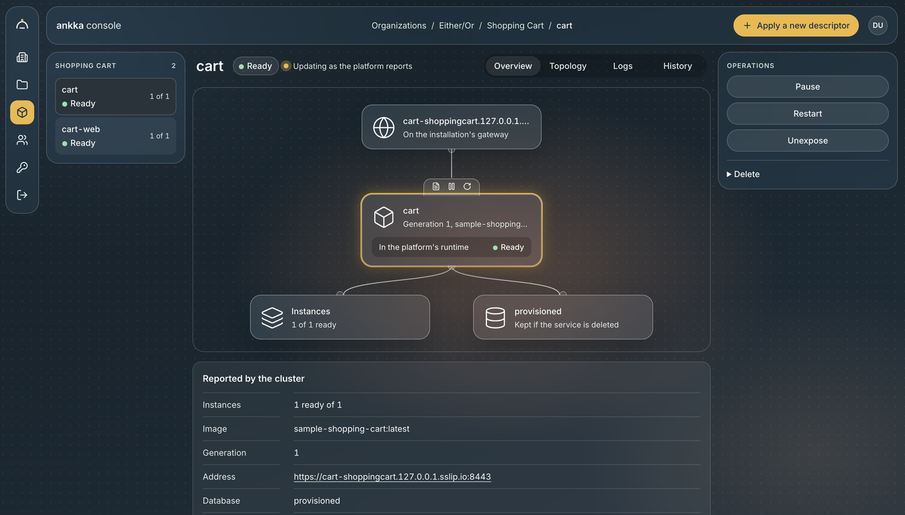

<picture>
  <source media="(prefers-color-scheme: dark)" srcset="assets/ankka-lockup-dark.svg">
  
</picture>

[](https://github.com/thinkmorestupidless/ankka/actions/workflows/ci.yml) [](LICENSE.md)

[](docs/get-started/install.md) [](https://central.sonatype.com/artifact/com.thinkmorestupidless/ankka-core_3)<br>
[](docs/get-started/install.md) [](https://pypi.org/project/ankka/)<br>
[](docs/get-started/install.md) [](https://www.npmjs.com/package/ankka)<br>
[](docs/get-started/install.md) [](https://crates.io/crates/ankka)

ankka is a serverless platform for stateful services and agentic AI. You write components — entities,
workflows, views, agents, endpoints — and the platform runs them: distributed, durable, secured and
observed, on Kubernetes, with a database it provisions for you. Services are written in Scala, Python,
TypeScript or Rust.



It is a reimplementation of [Akka's](https://doc.akka.io/) component model on
[Apache Pekko](https://pekko.apache.org/), Apache 2.0 from top to bottom.

## Why ankka

### The actor model, without having to think about actors

Most backends are stateless processes in front of a database, with a cache, a queue, a workflow engine
and a cron server bolted on as each need arrives. ankka puts state, messaging, orchestration and time
into one model, built on the actor runtime that has carried Akka systems for more than a decade.

- **State lives in memory, beside the code that changes it.** An entity is loaded once, kept in memory
  and changed by one command at a time, so a read needs no database round trip and concurrent writes
  cannot race. Every change is journaled first, so nothing is lost when an instance goes.
- **Nothing is local by default, so scaling out is a number.** Components call each other through a
  client that finds wherever the target lives in the cluster. Entities spread across instances by id, so
  adding an instance adds capacity and your code does not change.
- **Deploys and failures cost no downtime.** A new instance joins the running cluster and takes over its
  share of entities before an old one stops, even when there is only one instance. An instance that dies
  has its entities rebuilt elsewhere from the journal.
- **Blocking is free.** Handlers run on virtual threads, so a workflow step or an agent's tool that calls
  three other components is three lines of sequential code, not a chain of futures.

[How ankka works](docs/concepts/architecture.md) · [Clusters and instances](docs/concepts/clustering.md) ·
[Consistency](docs/concepts/consistency.md)

### Serverless: the operating is the platform's job

A service is a container image and a short descriptor. `ankka services apply` does the rest:

- **Its own database, provisioned automatically**, in its project's Postgres — created on first deploy,
  its schema applied before the service starts, and never deleted when the service is. There is no
  password to manage: the service logs in with a certificate the platform issues and renews.
- **Topics on the installation's Kafka**, declared once on a project and made by the platform; each
  service reaches its project's topics, and no other project's, with the same certificate.
- **Zero-trust networking by default.** Every connection between instances, services and databases is
  mutual TLS with certificates the platform issues and rotates, and a service knows from the certificate
  which service is calling.
- **One command to expose a service**, at its own hostname with a certificate, through the installation's
  gateway.
- **Observability built in.** Each service's topology — who calls whom, how often and how slowly — is
  counted as it runs and merged across its instances, beside its metrics and logs; on your machine, every
  request is traced through every component it touched.
- **Organizations, projects and access control**, with sign-in through the installation's own identity
  provider, deploy tokens for CI, and a [GitHub Action](https://github.com/thinkmorestupidless/ankka-action).

It is serverless you can run yourself: the whole platform installs into a Kubernetes cluster, or onto
your laptop with kind and one script.

[Deploy a service](docs/deploy/deploy-a-service.md) · [Databases](docs/platform/databases.md) ·
[Networking and TLS](docs/platform/networking.md) · [Observability](docs/concepts/observability.md)

### Built to be built by a model

Coding agents write a lot of code now, and two things stop that code being right: the language is too
low-level to say what is meant, and the requirement is too vague to know what was meant. ankka addresses
both.

**Building blocks instead of plumbing.** A model asked to write a distributed system in a general-purpose
language writes the distribution too — retries, locking, serialization, idempotency — and rewrites it each
time it gets it wrong. In ankka it writes components, and every handler returns an
[effect](docs/concepts/effects.md): a plain value describing what should happen, which the runtime carries
out. The pieces compose in one way, and in Scala the type system refuses the wrong ones — a query
handler cannot persist anything, by its signature. That is less code to generate, fewer tokens spent getting there, and
a unit test for every handler that runs in milliseconds with no infrastructure.

**A specification that cannot be read two ways.** [speckit-bdd](https://github.com/thinkmorestupidless/speckit-bdd)
extends [Spec Kit](https://github.com/github/spec-kit) to keep a feature's acceptance scenarios as Gherkin,
in a project-wide [glossary](GLOSSARY.md)'s words. Its checker turns every undefined word, synonym,
contradiction and untraced requirement into a clarification question before anything is planned. A
Scala service runs those scenarios as its tests, so the specification and the behaviour cannot drift
apart. ankka's own
[features](features/) are written this way.

**And the model knows the platform.** Every project `ankka init` makes carries ankka's documentation as Agent Skills for the
version it was built against, with samples copied from code the build compiles and tests, and `ankka mcp`
gives an agent the CLI, the services running on your machine and the docs as MCP tools.

[Work with a coding agent](docs/get-started/coding-agents.md) ·
[Acceptance scenarios as tests](docs/build/testing.md#acceptance-scenarios-as-integration-tests)

### Agents are components

An agent is a component like any other, so it inherits everything above: its session memory is an event
sourced entity, durable and shared between agents; its tools call other components through the same
client; it scales, survives restarts and is traced like the rest. The runtime runs the model loop, so
your code is only called to run a tool or check a guardrail and never holds the model's key. Autonomous
agents work a task until it is done, and judgments ask a model for typed answers — a choice, a score, a
yes or no — with probabilities.

[Agents](docs/concepts/agents.md) · [Autonomous agents](docs/concepts/autonomous-agents.md) ·
[Judgments](docs/build/judgments.md)

### Your language, one platform

Scala services run in the runtime's own JVM. Python and TypeScript services run beside it as a sidecar,
and Rust services are WebAssembly modules loaded into it — the same components, the same guarantees and
the same deployment in each. A user interface in any language deploys beside them as a web-hosted service.

[One platform, several languages](docs/concepts/polyglot.md) · [Deploy a user interface](docs/deploy/web-hosting.md)

### Open, and honest about it

Apache 2.0, with no licence condition on who runs the platform or what they run on it. What it does not
do yet is listed plainly in [Limitations](docs/reference/limitations.md), and where it differs from Akka
on purpose, [Divergences from Akka](docs/reference/akka-divergences.md) says why.

## Get started

```bash
brew install thinkmorestupidless/tap/ankka
ankka init cart                         # or --language python, typescript, rust
```

[Install the tools](docs/get-started/install.md) covers every platform and language, then write a first
service in [Scala](docs/get-started/first-service-scala.md), [Python](docs/get-started/first-service-python.md),
[TypeScript](docs/get-started/first-service-typescript.md) or [Rust](docs/get-started/first-service-rust.md),
and [deploy it to a local platform](docs/get-started/deploy-locally.md).

## Documentation

**[docs.ankka.cloud](https://docs.ankka.cloud/)**, and the same pages as Markdown in [`docs/`](docs/index.md):
[concepts](docs/concepts/architecture.md), [building](docs/build/event-sourced-entities.md),
[deploying](docs/deploy/run-locally.md), [operating](docs/operate/local-console.md),
[running the platform](docs/platform/install-local.md) and the [reference](docs/reference/cli.md). The site
also publishes `llms.txt` and `llms-full.txt`.

## This repository

The runtime and SDKs (`modules/`, `sdks/`), the control plane, operator and CLI, the sidecar, the console,
the platform's manifests (`kustomization/`), the samples and the documentation. Contributing starts at
[`CLAUDE.md`](CLAUDE.md) and the topic files in [`.claude/rules/`](.claude/rules): the architecture, the build,
and the traps that have already cost debugging time.

## Licence

[Apache 2.0](LICENSE.md), matching Pekko.
